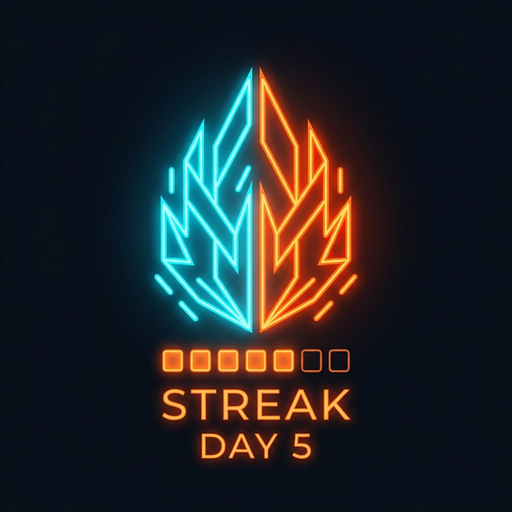

# 🔥 RACHA — Contador de Racha de Estudio Diario

<p align="center">
  
</p>

<p align="center">
  <b>Tu fuego diario de estudio y disciplina sin distracciones.</b><br>
  Aplicación Android nativa desarrollada en Kotlin y Jetpack Compose con arquitectura MVVM, Room Database y estética Neón AMOLED.
</p>

<p align="center">
  
  
  
  
  
  
</p>

---

## 🎯 ¿Qué es RACHA?

> *"El fuego de tu racha se alimenta de tu decisión, no de tus ganas."*

**RACHA** es una aplicación enfocada en la consistencia y la creación de hábitos de estudio duraderos. Diseñada bajo la filosofía de fricción cero: **una sola pantalla, sin conexión a internet requerida, sin anuncios y en modo oscuro neón de alto impacto.**

---

## ⚡ Características Principales

| Característica | Descripción |
| :--- | :--- |
| **🔥 Contador Gigante de Racha** | Marcador numérico animado (86sp) que rastrea tus días consecutivos de estudio con algoritmos inteligentes de continuidad. |
| **🎯 Botón «Hoy sí estudié»** | Microinteracción táctil con retroalimentación háptica, persistencia inmediata y animación de partículas neón. |
| **📊 Últimos 7 Días** | Calendario semanal interactivo con barras de cumplimiento, porcentajes y opción para registrar o ajustar días anteriores. |
| **💡 Mensajes Motivadores** | Motor dinámico con más de 30 reflexiones seleccionadas sobre disciplina, esfuerzo y crecimiento personal que cambian en cada interacción. |
| **🌙 Modo Oscuro Neón** | Paleta AMOLED (`#07090E`) con acentos vibrantes (Cian eléctrico, Naranja fuego, Verde lima y Violeta). |
| **🔒 100% Privado y Offline** | Todos los datos se almacenan exclusivamente en la base de datos local SQLite del dispositivo mediante Room. |

---

## 🏗️ Arquitectura del Proyecto

El proyecto sigue las directrices oficiales de **Clean Architecture** y el patrón **MVVM (Model-View-ViewModel)** de Android Jetpack:

```
app/src/main/java/com/example/
├── data/
│   ├── db/
│   │   ├── RachaDatabase.kt       # Base de datos local SQLite con Room
│   │   └── StudyDayDao.kt         # Queries reactivas y operaciones CRUD
│   ├── model/
│   │   └── StudyDayEntity.kt      # Entidad de persistencia por fecha ISO
│   ├── repository/
│   │   └── StudyRepository.kt     # Abstracción de datos con Flow
│   └── MotivationalQuotes.kt      # Catálogo de frases inspiracionales
├── ui/
│   ├── components/
│   │   └── ConfettiEffect.kt      # Efecto de partículas neón en Canvas
│   ├── theme/
│   │   ├── Color.kt               # Paleta de colores Neón AMOLED
│   │   ├── Theme.kt               # Definición del tema Dark Mode M3
│   │   └── Type.kt                # Tipografía de gran formato
│   ├── RachaScreen.kt             # Composable principal de la pantalla
│   └── RachaViewModel.kt          # Lógica de racha, estado y feedback háptico
├── util/
│   └── DateUtils.kt               # Algoritmo de cálculo de racha consecutiva
└── MainActivity.kt                # Punto de entrada con Edge-to-Edge
```

---

## 🧮 Lógica de Cálculo de Racha

1. **Racha Activa:**
   - Si hoy ya se registró estudio: se cuentan los días consecutivos hacia atrás incluyendo hoy.
   - Si hoy aún no se registra estudio, pero ayer sí se estudió: la racha se mantiene viva contando hacia atrás desde ayer para motivar a completar el día actual.
   - Si ni hoy ni ayer se estudió: la racha consecutiva se reinicia a 0.
2. **Historial de 7 Días:** Ventana deslizante de los últimos 7 días con porcentaje de cumplimiento sobre la semana.
3. **Mejor Racha:** Cálculo histórico continuo de la mayor racha alcanzada desde el primer registro.

---

## 🛠️ Tecnologías y Librerías

- **Lenguaje:** Kotlin 2.0+
- **UI:** Jetpack Compose & Material Design 3 (M3)
- **Persistencia:** AndroidX Room con KSP (Kotlin Symbol Processing)
- **Asincronía y Reactividad:** Kotlin Coroutines (`viewModelScope`) y `StateFlow`
- **Testing:** JUnit 4 + Robolectric para pruebas JVM rápidas de CUJs

---

## 🚀 Instalación y Ejecución

### 1. Clonar el repositorio:
```bash
git clone https://github.com/TU_USUARIO/racha-neon-study-streak.git
cd racha-neon-study-streak
```

### 2. Abrir en Android Studio:
- Abrir **Android Studio** (Koala o más reciente).
- Seleccionar **Open** y elegir el directorio del proyecto.
- Esperar la sincronización de Gradle.

### 3. Compilar APK Debug:
```bash
./gradlew assembleDebug
```
El archivo `.apk` se generará en:
`app/build/outputs/apk/debug/app-debug.apk`

### 4. Ejecutar pruebas unitarias:
```bash
./gradlew testDebugUnitTest
```

---

## 📱 Requisitos del Dispositivo

- **Sistema Operativo:** Android 7.0 (API level 24) o superior.
- **Permisos requeridos:** Ninguno para red; únicamente permiso normal de vibración (`VIBRATE`) para retroalimentación táctil.
- **Acceso a Internet:** No requerido (0 bytes transmitidos).

---

## 📄 Licencia

Este proyecto está bajo la Licencia **MIT**. Puedes usarlo, modificarlo y compartirlo libremente.

---

<p align="center">
  Hecho con 🔥 para estudiantes que buscan disciplina diaria inquebrantable.
</p>
